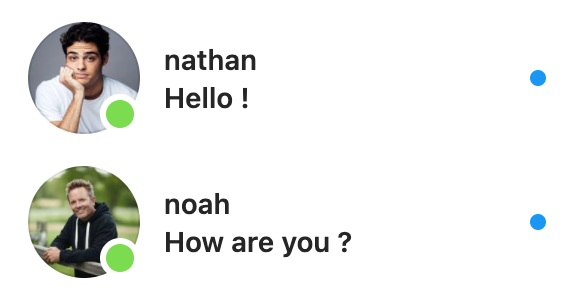
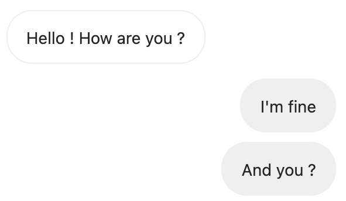

# 📖 Présentation
Le module utilise [Selenium](https://www.selenium.dev/), il permet d'envoyer ou de lire des messages sur [**Instagram**](https://www.instagram.com/direct/inbox/).

# ⚙️ Configuration

💾 Importer le module : 
`from instadm import InstaDM`


`insta = InstaDM(username="yourusername", password='yourpassword', headless=True, waiting=True)`

`username` - Votre nom d'utilisateur Instagram

`password` - Votre mot de passe Instagram

`headless` - Si vous voulez afficher la page web

`waiting` - Si vous voulez que le programme fasse des pauses pour éviter qu'il ne soit bloqué([En savoir plus]())

# 📱 Utilisation
## 🗒 Lire les messages
### 📬

`insta.NewMsg()`

Renvoie tous les messages non-lus avec l'expéditeur qui correspond sous forme de dictionnaire



**Exemple de résultat :**

`{'nathan':'Hello !','noah':'How are you ?'}`

### 📨

`insta.NewMsg(exp="friend's username")`

Renvoie tous les messages entre vous et le nom d'utilisateur donné, renvoie **True** si le message vient de vous sinon **False**



**Exemple de résultat :** 

`(['Hello ! How are you ?', 'I'm fine', 'And you ?'], [False, True, True])`

## 📝 Envoyer des messages
### 👤

`insta.sendMessage(user='friend's username', message='Hello !')`

Envoie `message` à `user`

### 👥

`insta.sendGroupMessage(users=['friend's username', 'another friend's username'], message='Hello everyone !')`

Envoie `message` aux noms d'utilisateur `users`

## 💾 Exemple d'utilisation
```python
# Import the module
from instadm import InstaDM

# Login
insta = InstaDM(username="notes_et_reglages", password='Emilien2007', headless=False, waiting=True)

# Retrieve unread messages
Messages = insta.NewMsg()
print(Messages)

# Retrieve messages with "kevin"
MessagesFromInstagramCreator = insta.NewMsg(exp="kevin")
print(MessagesFromInstagramCreator)

# Send a message to "kevin"
insta.sendMessage(user="kevin", message="Hello !")

# Send a message to "kevin" and "mikeyk"
insta.sendGroupMessage(users=['kevin', 'mikeyk'], message='Hello everyone !')
```

Le fichier est disponible [ici](test.py).

>[**Kevin Systrom**](https://www.instagram.com/kevin/)(kevin) et [**Mike Krieger**](https://www.instagram.com/mikeyk/)(mikeyk) sont les créateurs d'**Instagram**. On ne peut pas leur écrire

# ⚖️ Politique d'Instagram

>"Encouragez les interactions intéressantes et authentiques.
>Aidez-nous à lutter contre les contenus indésirables en évitant [...] de contacter de façon répétée des personnes à des fins commerciales sans leur consentement."
>
>*Extrait du [règlement de la communauté](https://www.facebook.com/help/instagram/477434105621119/), 2021 Instagram, Inc*

**Le module ne va à l'encontre des règles de la communauté qui lorsqu'il est mal utilisé.**

# 📎 Autres...


### 🖥 Mon compte Twitter


**[twitter.com/emilien_barde](https://twitter.com/emilien_barde)**

### 💰 Me soutenir
**[paypal.com/emilienb31](https://www.paypal.com/paypalme/emilienb31)**

### 📚 Documentation

>[J'ai utilisé **beaucoup de code d'ici**](https://github.com/CamTosh/instagram-bot-dm) Par [ToshCamille](https://twitter.com/ToshCamille)
>
>[Documentation Selenium](https://selenium-python.readthedocs.io/)
>
>[Vidéo intéréssante...](https://www.youtube.com/watch?v=pHFsGWC8LSU) Par [Graven - Développement](https://twitter.com/Gravenilvec)
